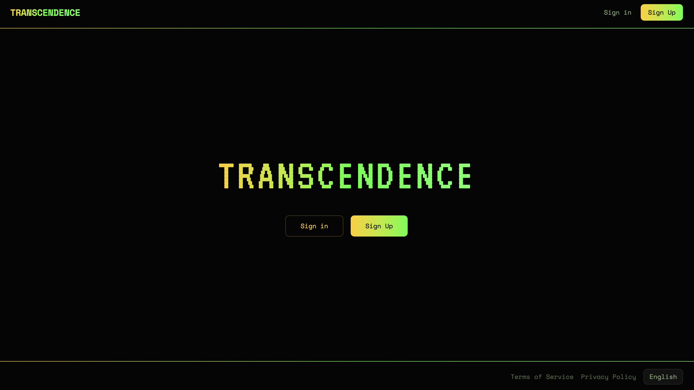
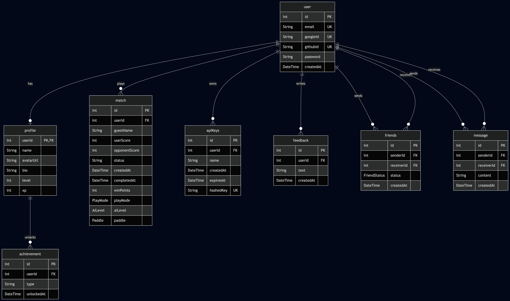

*This project has been created as part of the 42 curriculum by  **alphbarr**, **mfleury**, **mpietrza**, **rgiambon**, and **sadoming** at 42.*
# ft_transcendence

A full-stack single-page web application centered around a real-time 1v1 Pong game, built as part of the [42 curriculum](https://42.fr/).

Users can sign up, play Pong against each other or an AI opponent, chat with friends, climb the leaderboard, and manage their profiles. The platform also exposes a public API with an interactive playground, supports six languages, and runs in a fully containerized Docker environment secured with a WAF, rate limiting, and HashiCorp Vault.



---

## Table of Contents

- [Getting Started](#getting-started)
- [Technical Stack](#technical-stack)
- [Features](#features)
- [Database Schema](#database-schema)
- [Modules](#modules)
- [Project Management](#project-management)
- [Team & Individual Contributions](#team--individual-contributions)
- [AI Usage Disclosure](#ai-usage-disclosure)
- [Resources](#resources)

---

## Getting Started

### Prerequisites

- [Docker](https://docs.docker.com/engine/install/) with Docker Compose
- A GitHub OAuth client ID and secret

### Installation

```bash
chmod +x install.sh
./install.sh
```

The interactive installer will prompt you for OAuth credentials, generate secrets, and check for available ports. Once complete, open the app in your browser.

---

## Technical Stack

### Backend

| Technology | Role |
|---|---|
| **Node.js + Express 5** | Application server and API routing |
| **TypeScript** | Type safety across the full stack |
| **PostgreSQL 16** | Relational database |
| **Prisma 7** | ORM with type-safe queries and automatic migrations |
| **Socket.io** | Real-time chat and presence via WebSockets |
| **Passport.js** | OAuth 2.0 (GitHub, 42) |
| **JWT (HTTP-only cookies)** | Session management (XSS-resistant) |
| **bcrypt** | Password hashing (12 salt rounds) |
| **HashiCorp Vault** | Secret management (JWT key, DB credentials, OAuth secrets) |
| **Swagger** | Interactive public API documentation at `/api-docs` |
| **Helmet / CORS / express-rate-limit** | HTTP hardening and rate limiting |
| **Axios** | Server-side HTTP requests during OAuth flows |
| **multer** | Avatar uploads (PNG/JPEG only, timestamped filenames) |

The API is served under `/api/v1` across seven route groups: **auth**, **profile**, **matches**, **friends**, **chat**, **api-keys**, and **public**. Protected routes use a `protect` middleware that verifies a JWT from an HTTP-only cookie against a secret stored in HashiCorp Vault; public routes authenticate via API keys sent as Bearer tokens and hashed with SHA-256 server-side.

Authentication combines JWT in HTTP-only cookies (to prevent XSS token theft), Passport.js for GitHub OAuth, and bcrypt (12 salt rounds) for password hashing. All secrets (JWT key, DB password, OAuth credentials) live in Vault and are fetched at startup -- nothing is hardcoded or stored in plaintext. Helmet sets secure HTTP headers (HSTS, CSP, X-Frame-Options), CORS is locked to the frontend origin with credentials enabled, and express-rate-limit enforces per-group thresholds: 20 requests/15 min on auth endpoints, 500/15 min elsewhere.

Real-time features (chat, online status) use Socket.io with a room system (`user:{id}`) for targeted delivery, alongside REST endpoints as a fallback. The public API is documented with Swagger at `/api-docs`, generated from OpenAPI annotations in the route files.

#### Why These Choices?

**PostgreSQL** fits naturally because the data is relational: users, profiles, matches, friends, messages and foreign keys with cascade deletes keep it consistent. **Prisma** adds compile-time type safety and a schema file that doubles as living documentation. **Express 5** gives a clean middleware pattern for layering auth, rate limiting, and CORS without cluttering route handlers, and **TypeScript** across the full stack catches bugs early.

**JWT in HTTP-only cookies** over localStorage eliminates XSS-based token theft. **Passport.js** abstracts OAuth redirect flows into simple strategy configs. **bcrypt** is battle-tested and its salt rounds make brute-force impractical. **Socket.io** handles reconnection, fallback transports, and per-user rooms out of the box, while REST fallbacks ensure messages can always be sent. **Helmet**, **CORS**, and **express-rate-limit** each solve one security concern with minimal configuration. **Vault** keeps secrets out of the codebase entirely. **multer** handles file uploads with type filtering, and **Swagger** keeps API docs in sync with the code automatically.

### Frontend

| Technology | Role |
|---|---|
| **React + TypeScript** | Component-based UI with compile-time type checking |
| **Vite** | Development server with instant hot reload |
| **TailwindCSS** | Utility-first styling without separate CSS files |
| **React Router** | Client-side navigation |
| **HTML5 Canvas** | Custom Pong game engine |
| **Socket.io Client** | Real-time chat communication |
| **i18n** | Internationalization (6 languages) |
| **React Markdown** | Rendering legal pages from `.md` files |

The frontend is a single-page application built with the latest versions of React and TypeScript. Vite serves as the local development server for fast iteration. Styling is done entirely with TailwindCSS. Client-side navigation is managed by React Router. The Pong game runs on an HTML5 Canvas element powered by a custom TypeScript game engine. Chat communicates with the backend via WebSockets. The i18n internationalization system is used throughout, with React Markdown for large text blocks such as Terms of Service and Privacy Policy pages.

#### Why These Choices?

- **React** was chosen for its component-based architecture, making it easy to build and reuse UI elements across the application.
- **TypeScript** catches errors at compilation instead of at runtime.
- **TailwindCSS** allows fast, consistent styling directly in component files without separate CSS files -- more open and manageable than Bootstrap or other options.
- **Vite** was chosen over older tools because it starts the development server almost instantly and provides fast reloads on every save.
- **WebSockets** were chosen for the fast, bidirectional communication needed for live chat.
- **HTML5 Canvas** gives full low-level control over what is drawn on screen every frame, enabling smooth game animation and physics.
- **i18n** was chosen for clarity and simplicity of use throughout the project.
- **React Markdown** was used when chunks of text were large enough that they would bloat the i18n `translations.ts` file; separate `.md` files are stored in `./client/public/legal` and are easily manageable.

### Infrastructure

| Technology | Role |
|---|---|
| **Docker + Docker Compose** | Full-stack containerization (frontend, backend, DB, Nginx, Vault) |
| **Nginx** | Reverse proxy and first-layer rate limiting |
| **ModSecurity v3 + OWASP CRS** | Web Application Firewall |
| **Go + tview** | Interactive terminal installer |

---

## Features

| Feature | Description | Contributors |
|---|---|---|
| **Pong Game** | Multiplayer game with AI opponent (3 difficulty levels), keyboard and touch input | sadoming |
| **User Authentication** | Sign up, log in, GitHub OAuth, JWT sessions, CSRF protection | mpietrza, alphbarr, rgiambon |
| **User Profiles** | Customizable profiles with avatar upload, stats, match history, achievements | rgiambon, mpietrza, alphbarr |
| **Real-time Chat** | Direct messaging between friends with online/offline status indicators | mpietrza, rgiambon |
| **Social System** | Friend requests, friend list, online status tracking via Socket.io | rgiambon, mpietrza |
| **Leaderboard** | Player rankings by wins with win-rate tiebreaker | mpietrza, rgiambon |
| **API Playground** | Generate API keys and test public endpoints interactively | mpietrza |
| **Settings** | Account management (update profile, change password) | mpietrza, rgiambon |
| **Internationalization** | 6 languages: English, Spanish, Catalan, French, Italian, Polish | mpietrza |
| **Security** | ModSecurity WAF, rate limiting, Helmet, CORS, Vault secret management | alphbarr |
| **Responsive Design** | Mobile-friendly layout with touch controls for the game | mpietrza |
| **Containerized Deployment** | Full Docker Compose orchestration with multi-stage builds | mfleury |
| **Interactive Installer** | Go-based terminal UI for environment setup | mfleury |
| **Gamification** | Achievements (first game, first win, perfect game, 5 games) and XP/level system | alphbarr, mpietrza, rgiambon |

---

## Database Schema



PostgreSQL database managed via Prisma ORM with 8 models:

| Model | Purpose | Key Relations |
|---|---|---|
| **user** | Authentication and identity | Central entity referenced by all other models |
| **profile** | Public data (name, avatar, bio, level, XP) | 1:1 with user (cascade delete) |
| **match** | Pong game records | N:1 with user; tracks scores, mode, AI level, paddle side |
| **achievement** | Unlockable badges | N:1 with profile; composite unique on `(userId, type)` |
| **friends** | Friendship system | Two N:1 relations to user (sender/receiver); status: `PENDING` or `ACCEPTED` |
| **message** | 1-on-1 chat | Two N:1 relations to user (sender/receiver); composite index for fast history queries |
| **apiKeys** | API key management | N:1 with user (cascade delete) |
| **feedback** | User feedback | N:1 with user (cascade delete) |

### Key Design Decisions

- **Cascade deletes** on most tables: if a user is removed, their profile, messages, friendships, and API keys are automatically cleaned up.
- **Unique constraints** where it matters: a user can only send one friend request to the same person, and achievements can't be unlocked twice.
- **Composite indexes** on messages (sender, receiver, timestamp) so chat history queries stay fast even with a lot of data.
- **Optional password field** because users who sign in through GitHub don't have one.
- **Database-level enums** (like `PENDING`/`ACCEPTED` for friend status, or `AI`/`LOCAL` for game mode) instead of plain strings to prevent invalid values from ever being stored.

---

## Modules
Point calculation (Major = 2pts, Minor = 1pt)
| **Category** | **Module name** | **Points** |
|---|---|---|
| **Web** | Use a framework for both the frontend and backend | 2 |
| **Web** | Implement real-time features using WebSockets or similar technology | 2 |
| **Web** | Allow users to interact with other users | 2 |
| **Web** | A public API with a secured API key, rate limiting, documentation, and at least 5 endpoints | 2 |
| **Web** | Use an ORM for the database | 1 |
| **Web** | Custom-made design system with reusable components | 1 |
| **Accessibility and Internationalization** | Support for multiple languages (at least 3 languages) | 1 |
| **Accessibility and Internationalization** | Support for additional browsers | 1 |
| **User Management** | Standard user management and authentication | 2 |
| **User Management** | Game statistics and match history | 1 |
| **User Management** | Implement remote authentication with OAuth 2.0 | 1 |
| **Artificial Intelligence** | Introduce an AI Opponent for games | 2 |
| **Cybersecurity** | Implement WAF/ModSecurity (hardened) + HashiCorp Vault for secrets | 2 |
| **Gaming and User Experience** | Implement a complete web-based game where users can play against each other | 2 |
| **Gaming and User Experience** | A gamification system to reward users for their actions | 1 |
| **Module of Choice** | Implement an automated installer | 1 |
| | Sum: | 24 |


### IV.1 Web

**Major: Use a framework for both the frontend and backend** *(everyone)*

We picked React with TypeScript for the frontend because it lets us break the UI into reusable components and catch bugs early with types. For the backend, Express felt like the right fit: it's lightweight and gives us full control over how we wire up middleware like our WAF, CSRF protection, and Vault integration. Vite handles the build and gives us instant hot reload during development. Everything runs in Docker containers behind Nginx.

**Major: Implement real-time features using WebSockets or similar technology** *(mpietrza, rgiambon)*

We went with Socket.io because it handles reconnections and room-based messaging out of the box, which saved us a lot of headache. When a user logs in, the server authenticates their socket using the JWT cookie, drops them into a personal room, and immediately tells them which friends are online. Chat messages flow through the socket in real-time and get persisted to the database so nothing is lost.

**Major: Allow users to interact with other users** *(mpietrza, rgiambon)*

We built a friends system where you send a request and the other person accepts or rejects it -- only accepted friends can chat. Message history is loaded via REST with pagination, but new messages arrive instantly through Socket.io. Online presence is tracked server-side and broadcast to friends when someone connects or disconnects.

**Major: A public API with a secured API key, rate limiting, documentation, and at least 5 endpoints** *(rgiambon, mpietrza)*

We exposed five endpoints (leaderboard, player stats, feedback, profile update, account deletion) under `/api/v1/public/`. They're all protected by API keys: when a key is created we hash it with SHA-256 and only store the hash, so even if the database leaks the keys are safe. We added rate limiting at both the Nginx and Express layers. The full public API documentation is available at `/api-docs`, where developers can browse all available endpoints, see request/response schemas, and understand authentication requirements — all generated from OpenAPI annotations in the codebase.

**Minor: Use an ORM for the database** *(rgiambon)*

We chose Prisma because it generates TypeScript types directly from the database schema, so our queries are type-checked at compile time. The schema defines 8 models backed by PostgreSQL, with enums to enforce things like friend request status and game modes at the database level.

**Minor: Custom-made design system with reusable components** *(mpietrza)*

We built over 19 reusable components: buttons with different variants, cards, inputs, headers, footers, avatar displays, leaderboard tables, and more. Everything is styled with TailwindCSS using a consistent color palette with semantic tokens so the whole app feels cohesive.

### IV.2 Accessibility and Internationalization

**Minor: Support for multiple languages (at least 3 languages)** *(mpietrza)*

We support 6 languages (English, Spanish, Catalan, French, Italian, and Polish) all in one translation file. A React context provider makes translations available anywhere in the app through a `useLanguage()` hook, and users can switch languages on the fly with a selector in the header.

**Minor: Support for additional browsers** *(everyone)*

The app works across all major browsers. For mobile users, we detect touch devices and swap keyboard controls for a touch slider to move the paddle. The game canvas scales to fit any screen size.

### IV.3 User Management

**Major: Standard user management and authentication** *(alphbarr, rgiambon)*

We use JWTs stored in HTTP-only cookies with `Secure` and `SameSite=Strict` flags, which protects against both XSS and CSRF by default. Passwords are hashed with bcrypt and must be at least 12 characters with a mix of letters and numbers. On top of that, we implemented a double-submit CSRF token pattern for all state-changing requests, so even if someone tricks a user into clicking a malicious link, the request gets rejected.

**Minor: Game statistics and match history** *(alphbarr, mpietrza, rgiambon)*

Every match gets saved with scores, game mode, and timestamps. The server computes stats like wins, losses, and ranking on the fly: rank is based on total wins with win rate as a tiebreaker. Users can browse their match history and see where they stand on the leaderboard.

**Minor: Implement remote authentication with OAuth 2.0** *(alphbarr, rgiambon)*

We integrated GitHub as login providers using Passport.js. All the OAuth credentials live in Vault rather than environment files. We also added state cookies during the OAuth flow to prevent CSRF attacks, and the callback URLs are configurable through an environment variable so everything works across different deployment environments.

### IV.4 Artificial Intelligence

**Major: Introduce an AI Opponent for games** *(sadoming)*

The AI runs entirely on the client side with three difficulty levels. Easy mode uses basic ball tracking with a 20% chance of making mistakes on any given frame. Medium tightens that to 10% and speeds up the ball. Hard mode actually predicts where the ball will be one frame ahead and only messes up 2% of the time. Each level also tunes paddle acceleration and max speed so the difficulty curve feels natural rather than just "faster = harder."

### IV.5 Cybersecurity

**Major: Implement WAF/ModSecurity (hardened) + HashiCorp Vault for secrets** *(alphbarr)*

We run ModSecurity v3 with the OWASP Core Rule Set on Nginx, which catches common attacks like SQL injection and XSS before they even reach our app. We had to fine-tune some rules: for example, disabling false positives on REST methods, JSON bodies, OAuth parameters, and the Socket.io path. Rate limiting is enforced at two layers: Nginx (5 req/min for auth, 120 req/min for APIs) and Express. All secrets -- JWT key, database credentials, OAuth client secrets -- are stored in HashiCorp Vault and fetched at startup with retry logic to handle Docker container timing issues. In development, environment variables work as a fallback.

### IV.6 Gaming and User Experience

**Major: Implement a complete web-based game where users can play against each other** *(sadoming)*

We built the Pong engine in plain TypeScript drawing directly on an HTML5 Canvas, wrapped by a React component that handles the lifecycle. The physics engine deals with ball-paddle collisions using AABB detection and adjusts the bounce angle based on where the ball hits the paddle. The game loop runs at 60 FPS through `requestAnimationFrame`. Players can choose between AI and local two-player mode, pick their paddle side, and set how many points to win. It supports keyboard and touch input so it works on both desktop and mobile.

**Minor: A gamification system to reward users for their actions** *(alphbarr, mpietrza, rgiambon)*

We added four achievements that unlock automatically when you play: first game completed, first win, a perfect game where you shut out the opponent, and five games played. There's also an XP system (50 XP for a win, 10 for a loss) with level thresholds that get progressively harder so early levels come quick but later ones take more effort.

### IV.7 Module of Choice

**Minor: Implement an automated installer** *(mfleury)*

We added this module because the subject requires the app to run with a single command, but without detailing how the environment is set up. Having an installer with a terminal graphical interface gives a better user experience, helping the user set up the required GitHub APIs that cannot be shipped with the app, silently generate tokens and secrets, and check if the chosen port is effectively available on the machine. The choice was made to use Go with the tview library (similar to ncurses), giving us the opportunity to learn a new language while the rest of the app was built in TypeScript.

---

## Project Management

### Roles

| Member | Role | Expertise |
|---|---|---|
| **mfleury** | Project Manager | DevOps |
| **mpietrza** | Product Owner | Frontend |
| **rgiambon** | Tech Lead | Backend |
| **alphbarr** | Developer | Cybersecurity |
| **sadoming** | Developer | Game Development |

Roles were assigned in the first team meeting. On top of PM/PO/Tech Lead, each member was also assigned an expertise topic (cybersecurity, devops, frontend, backend, and game development).

### Process

1. **Product definition** -- The PO led a feature alignment meeting where the team voted on scope. We leveraged **Jira Product Discovery** to list all ideas, vote, and determine what would go into the final product and what would be below the line.
2. **Architecture** -- The Tech Lead made the technology and architecture choices, then each expert built a backlog of tasks in **Jira Scrum**.
3. **Sprint planning** -- The PM created weekly sprints.
4. **Weekly standups** -- Every Tuesday on **MS Teams** to review completed tasks, align on the next focus, ask questions, get clarifications, make decisions, and get help.
5. **Code review** -- All merges to the DEV branch went through **GitHub Pull Requests**.

### Tools

| Purpose | Tool |
|---|---|
| Communication | MS Teams, Slack |
| Scrum & Product | Jira |
| Documentation | Notion |
| Code Review | GitHub Pull Requests |

---

## Team & Individual Contributions

### mfleury -- DevOps & Project Manager

- Implemented the full Docker solution to orchestrate frontend, backend, Vault, Nginx, and database. Initial implementation of Nginx to allow end-to-end testing of backend + frontend at the start of the project.
- Implemented a "dev platform" consisting of a tailored `docker-compose` to surface required ports and variables for independent backend and frontend testing. Initially, a Makefile allowed building a "prod" version and a "dev" version of the app, also integrating `migrate` commands for Prisma migration. These files are now deprecated and kept in the archive folder.
- Created the installer from scratch using Go + tview (module of choice).
- Organized and led weekly sprint meetings as per PM role.

### rgiambon -- Backend & Tech Lead

Responsible for the backend architecture and implementation of the application. As Tech Lead, also helped make key technology stack decisions and supervised major structural changes in the codebase to maintain consistency across the project.

- Developed the REST API and designed the PostgreSQL database schema, defining the models and relationships for users, profiles, matches, friendships, messages, and API keys.
- Implemented the public API, including a system that allows users to generate API keys that are securely stored using hashing.
- Implemented the real-time layer for chat and presence updates.
- Worked to integrate the backend with the security infrastructure (WAF, Vault, and rate limiting) developed by alphbarr, ensuring the API remained both functional and secure.

**Challenges:**
- Implementing OAuth authentication in a development environment accessible from devices on the local network, since some providers (such as Google) do not allow IP-based redirect URLs. The team adapted the setup accordingly and focused on providers that supported this workflow.
- Coordinating backend and frontend integration, particularly for authentication, chat, and profile features.

### mpietrza -- Frontend & Product Owner

Responsible for the frontend architecture. Created pages based on React, TypeScript, and TailwindCSS, using Vite for live development.

- Created the basic schema for the whole page from the very beginning and step-by-step implemented the major routes: Signup, Login, Home, Terms of Service, Privacy Policy, Settings, Game, Social, and Chat (the latter three initially containing placeholders, then built out in cooperation with each feature owner -- game with sadoming, social and chat with rgiambon).
- Separated larger page chunks into components for code clarity and reusability. Reusable components supporting visual consistency include: Header, Footer, Button, Card, UserAvatar, LanguageSelector.
- Built the i18n system supporting 6 languages: English, Catalan, Spanish (Castellano), French, Italian, and Polish -- representing all the languages of the teammates.
- Used `LanguageContext` and `useLanguage()` hook to fully internationalize the entire UI. For pages containing large text blocks (Terms of Service and Privacy Policy), used React Markdown with separate `.md` files stored in `./client/public/legal` for each language, loaded with `useState` and `useEffect`.
- Implemented the API Playground page where users can generate and manage API keys and test the public API endpoints directly.
- As PO, defined the product vision by gathering suggestions from all teammates, led the initial alignment meeting where the team collectively agreed on scope and features, and maintained the backlog in collaboration with the PM mfleury.

**Challenges:**
- Implementing the PERN stack (PostgreSQL, Express, React, Node.js). As the person responsible for frontend architecture with many new technologies, implementing parts of the code based on backend, storage, and authentication technologies was challenging. After learning the basics of the PERN stack, worked collaboratively with rgiambon and alphbarr to make the code work properly.
- Implementing all content with mobile versions. Throughout the process, the team had to verify how features work on mobile devices and make adjustments. The most problematic parts were the footer and the game, both of which required completely redesigned layouts on mobile to be user-friendly, turning the limitations of small screens into opportunities.

### sadoming -- Game Developer

Built the entire replication of the Pong game, with an option for mobile play, implemented with the HTML5 `<canvas>` tag. The game was initially developed in pure JavaScript in a separate repository to avoid overlap with the web-app team, then integrated into this repository as a React component with TypeScript.

- Early prototype (JavaScript): https://github.com/Sulig/PONG
- Playable demo: https://sulig.github.io/PONG/

**Game settings:**
- Modify the maximum points for winning
- Play against a real player (local) or an AI
- Choose AI difficulty (easy / medium / hard)
- Choose your paddle side (left with W/S controls, right with arrow keys)

**Game engine file structure:**
- **AI** -- AI mechanics and difficulty tuning
- **OBPong** -- All game objects and structs, default attributes and initialization, object drawing, ball/paddle position updates, utilities (stuck ball detection, serve direction, countdown)
- **Physics** -- Ball collisions with environment and corners
- **Pong** -- Event listeners (key input), update method, game start and initialization
- **Render** -- Window scaling and render method
- **Settings** -- Customizable game settings

**Challenges:**
- Learning the `<canvas>` tag from scratch using [W3Schools game tutorial](https://www.w3schools.com/graphics/game_canvas.asp) and AI for deeper exploration. Started with visual tests and slowly integrated simple controls.
- Structuring the code into separate files by grouping functions by context (physics, rendering, hooks, objects, AI).
- Tuning AI difficulty -- added methods to make the AI slower and more likely to fail (with lower failure probability at higher difficulties).
- Mobile support -- implemented a slider input for paddle movement on touch devices.
- React integration -- adapting the game to work with React component lifecycle, connecting page settings to the game engine, and fixing integration bugs.

### alphbarr -- Security Architect

Security architect and full-stack contributor covering Vault secret handling, JWT/Passport authentication, WAF (ModSecurity/OWASP CRS) tuning, rate limiting, HTTP hardening (Helmet, CORS, cookies), CSRF double-submit protection, and Prisma constraints that ensure data integrity for friends, matches, chats, API keys, and achievements. Ensured XP/leaderboard logic and achievement triggers are consistent with the gamification plan.

- **Security perimeter:** Led the ModSecurity v3 deployment on Nginx with the OWASP CRS tuned to avoid false positives on REST, JSON, OAuth, and Socket.io traffic, while enforcing rate limits at both Nginx (20 req/min auth, 500 req/min APIs) and Express layers (20 req/15 min auth, 500 req/15 min APIs). Helmet headers, strict CORS, and secrets fetched from HashiCorp Vault protect every facet of the HTTP layer.
- **User authentication and protection:** Architected the JWT-in-HTTP-only-cookie flow, Passport strategies (GitHub), and bcrypt password hashing (12 salt rounds) that back the `/auth` routes; added double-submit CSRF tokens, `Secure`/`SameSite` cookie flags, and Prisma constraints so user management stays resilient against XSS/CSRF attacks.
- **Data hygiene and gamification:** Ensured matches, achievements, and XP calculations persist through Prisma with cascade deletes; rolled out unique constraints so friends/messages/API keys stay consistent and achievements (first win, perfect game, five matches) unlock only once, while the backend computes leaderboard stats (wins, win rate) users see in their profile.
- **Backend partnership with rgiambon:** Paired on backend modules (authentication, user profiles, match history, leaderboard, real-time chat/presence, gamification, and OAuth) to make sure the secure JWT + Passport flows, Prisma models, and API endpoints were wired consistently while honoring the rate limits, Vault secrets, and WAF protections.

---

## AI Usage Disclosure

AI tools were primarily used as a **learning aid** while exploring new technologies used in the project. They helped clarify concepts, understand documentation, and provide examples when working with tools such as new frameworks, libraries, or infrastructure components. AI was also occasionally used to assist with **debugging**, helping identify possible causes of errors or suggesting alternative approaches when issues arose during development. In addition, AI was used for **repetitive or mechanical tasks**, such as adding language entries across the different translation sections of the i18n files or helping structure small pieces of documentation. All generated suggestions were reviewed and adapted by the team before being integrated into the project to ensure correctness and consistency with the codebase.

---

## Resources

- [Scrum overview (video)](https://www.youtube.com/watch?v=TRcReyRYIMg&t=12s)
- [How to build a PERN app (video)](https://youtu.be/ldYcgPKEZC8)
- [Create a REST API with Node.js and Express (Postman)](https://blog.postman.com/how-to-create-a-rest-api-with-node-js-and-express/)
- [Node.js REST API (W3Schools)](https://www.w3schools.com/nodejs/nodejs_rest_api.asp)
- [Dockerize a Node.js app](https://docs.docker.com/guides/nodejs/containerize/)
- [Socket.io tutorial](https://socket.io/docs/v4/tutorial/introduction)
- [Dockerizing a PERN app](https://medium.com/@zainsaleem022/dockerizing-a-pern-application-using-docker-compose-a60c596c3ba0)
- [HTML5 Canvas game tutorial (W3Schools)](https://www.w3schools.com/graphics/game_canvas.asp)

---


